# NYC Taxi ETL Pipeline 🚖

[](LICENSE)
[](https://www.python.org/downloads/release/python-3110/)
[](https://airflow.apache.org/)
[](https://aws.amazon.com/s3/)
[](https://www.postgresql.org/)

An end-to-end ETL pipeline using Apache Airflow to process and analyze NYC Yellow Taxi trip data. This project includes automated data ingestion, validation, PostgreSQL loading, and S3 archival.

---

## 📁 Project Structure

```
nyc-taxi-etl/
├── dags/                  
│   └── nyc_taxi_etl.py    
├── data/                  
│   └── yellow_taxi_data.csv  
├── scripts/               
│   ├── config.py
│   └── webserver_config.py
├── .env                   
├── .gitignore             
├── requirements.txt       
├── SETUP.md               
└── README.md           
```

---

## ⚙️ Technologies Used

- **Apache Airflow** for orchestration
- **Python 3.11** for ETL logic
- **Pandas** for data processing
- **PostgreSQL** for structured storage
- **Amazon S3** for cloud data backup
- **psycopg2** and **boto3** for database and S3 connections

---

## 🧪 ETL Pipeline Workflow

### 1. `download_data`  
Downloads NYC Yellow Taxi data (Parquet format) and converts it to CSV.

### 2. `load_to_postgres`  
Reads the CSV, performs data validation, and loads it into a PostgreSQL table.

### 3. `upload_to_s3`  
Uploads the CSV file to an Amazon S3 bucket for archival.

---

## 🔄 ETL Flow Diagram

```mermaid
```mermaid
flowchart LR

  %% ---------- INGESTION ----------
  subgraph Ingest
    A1[📄 Download:<br/>NYC Taxi Parquet] --> B1(download_data)
  end

  %% ---------- STAGING / CLEANING ----------
  subgraph Transform
    B1 --> C1[load_to_postgres]
    C1 --> PG[(PostgreSQL:<br/><b>nyc_taxi.yellow_taxi_data</b>)]
  end

  %% ---------- STORAGE / EXPORT ----------
  subgraph Export
    PG --> D1[upload_to_s3]
    D1 --> S3[(S3 Bucket:<br/><b>dataeng-clean-zone-dfa23</b>)]
  end

  %% ---------- STYLES ----------
  style A1 fill:#fffbe7,stroke:#444
  style B1 fill:#dde1ff,stroke:#444
  style C1 fill:#d9ead3,stroke:#444
  style PG fill:#cfe2f3,stroke:#444
  style D1 fill:#fce5cd,stroke:#444
  style S3 fill:#f9cb9c,stroke:#444
```



---

## 🧩 Components Glossary

| Component              | Type              | Description                                                                 |
| ---------------------- | ----------------- | --------------------------------------------------------------------------- |
| `download_data`        | Airflow Task      | Downloads NYC Taxi trip data in Parquet format and converts it to CSV.      |
| `load_to_postgres`     | Airflow Task      | Loads cleaned CSV data into a local PostgreSQL table.                       |
| `upload_to_s3`         | Airflow Task      | Uploads the CSV to AWS S3 for durable storage.                              |
| `nyc_taxi_etl.py`      | DAG Script        | The main DAG file orchestrating the ETL pipeline in Airflow.                |
| `yellow_taxi_data.csv` | Data File         | Raw trip record data from the NYC Taxi & Limousine Commission.              |
| `.env`                 | Environment File  | Stores sensitive configuration like AWS credentials (excluded from GitHub). |
| `config.py`            | Config Script     | Loads environment variables into the DAG using `dotenv`.                    |
| `requirements.txt`     | Dependency List   | Lists Python packages needed for the project.                               |
| `scripts/`             | Utility Directory | Custom helper scripts for loading config or uploading files.                |
| `data/`                | Data Directory    | Contains raw CSV files (not tracked in GitHub via `.gitignore`).            |

---

## 🚀 Getting Started

### Prerequisites

- Python 3.11+
- Apache Airflow
- PostgreSQL
- AWS account with S3 access

### 1. Clone this repository

```bash
git clone https://github.com/<your-username>/nyc-taxi-etl.git
cd nyc-taxi-etl
```

---

### 2. Set up your environment

```bash
python -m venv airflow_etl_env
source airflow_etl_env/bin/activate
pip install -r requirements.txt
```

---

### 3. Configure Airflow

```bash
export AIRFLOW_HOME=~/airflow
airflow db init
```

---

### 4. Set up environment variables
Create a .env file at the project root:

```dotenv
AWS_ACCESS_KEY_ID=your-access-key
AWS_SECRET_ACCESS_KEY=your-secret-key
S3_BUCKET_NAME=dataeng-landing-zone-dfa23
LOCAL_CSV_PATH=/tmp/yellow_taxi_data.csv
TABLE_NAME=yellow_taxi_data
```

---

### 5. Start Airflow services

```bash
airflow scheduler
airflow webserver
```
Access the UI at: http://localhost:8080

---

## 📊 Dataset

Source: [NYC TLC Trip Record Data](https://www.nyc.gov/site/tlc/about/tlc-trip-record-data.page)
> Due to GitHub file size limits, the CSV is not included in the repo.
> Download it manually or let the DAG download it for you.

---

## 📤 S3 Configuration

Make sure your AWS credentials are stored securely in .env. The DAG automatically uploads processed CSVs to the configured S3 bucket.

---

## 🔮 Future Pipeline Ideas

| Idea                        | Description                                                                                                           |
| --------------------------- | --------------------------------------------------------------------------------------------------------------------- |
| **Data Quality Checks**     | Add automatic validation rules using [Great Expectations](https://greatexpectations.io/) or built-in Airflow sensors. |
| **Partitioning in S3**      | Write partitioned CSV/Parquet files to S3 (e.g., by month or vendor) to improve scalability.                          |
| **Transform with dbt**      | Use [dbt](https://www.getdbt.com/) to model and document transformations inside PostgreSQL.                           |
| **Visualization Layer**     | Integrate with Power BI or Tableau to visualize trip patterns and performance KPIs.                                   |
| **Athena + Glue Catalog**   | Register S3 files with AWS Glue and query using Amazon Athena instead of PostgreSQL.                                  |
| **Stream Real-Time Data**   | Replace batch ingestion with real-time processing using Apache Kafka or AWS Kinesis.                                  |
| **Advanced Scheduling**     | Trigger DAGs based on file arrival events in S3 using Airflow sensors or AWS Lambda.                                  |
| **Machine Learning Models** | Add a model to forecast trip demand or flag suspicious rides based on fare metrics.                                   |
| **Delta Lake Integration**  | Convert pipeline storage format to Delta Lake to enable versioning and time travel.                                   |
| **CI/CD for DAGs**          | Use GitHub Actions or GitLab CI to deploy and test DAGs before production updates.                                    |

---

## ✍️ Author

Derek Acevedo
[GitHub](www.github.com/poloman2308) • [LinkedIn](www.linkedin.com/in/derekacevedo86)
